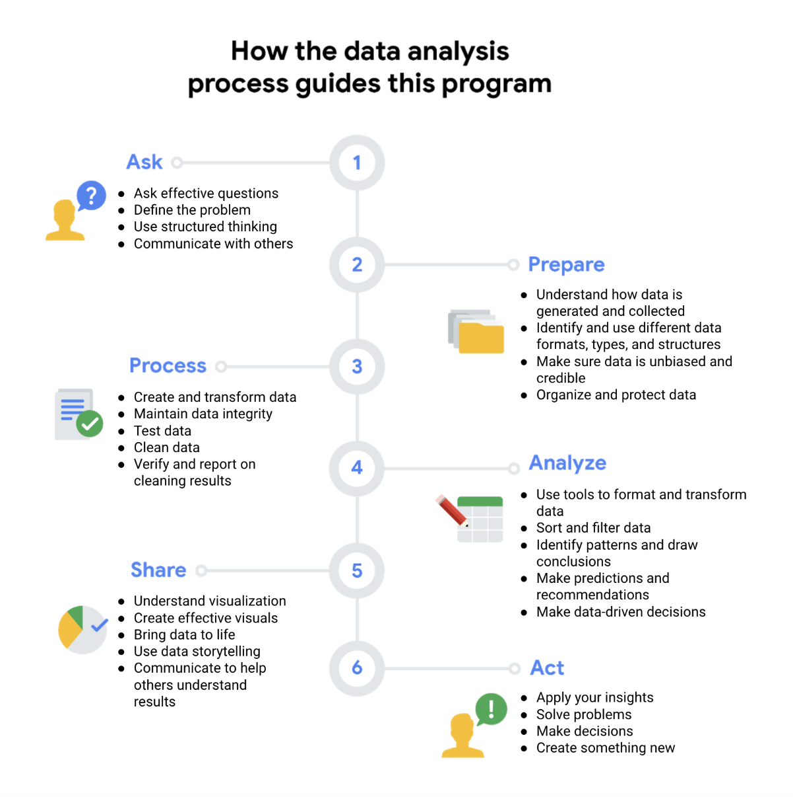

# Module 3: Data Life Cycle

# Data Life Cylce
* Tools:
    * Spreadsheets
    * Querying tools
    * Visualization tools

* Stages of the life cycle:
    * Plan - what is needed, how it will be managed, who will be responsible for it
    * Capture - Collect data
        * Database - collection of data stored in a computer system, should have data integrity, privacy 
    * Manage - how to store, how is it accessed
    * Analyze - solve problems 
    * Archive - store in a place where it is availabe but may not be used again
    * Destroy -  remove data from storage and delete any shared copies of the data.

# Phases of Data Analysis

* Ask
    * Stakeholders - people invested time or effort into the problem and are interested in the outcome
    * Should have strong communication skills
    * What is the problem, what is the purpose
* Prepare
    * Collect and store data
    * What type of data is needed, how will we collect it; new, does it already exist
* Process
    * Find and eleminate errors, remove outliers
    * Clean the data, understand its structure
* Analyze 
    * Transform the data 
    * Gain data-driven decisions
    * Objective and unbiased, look for patterns but let the data speak for itself
* Share
    * Visualization is important
* Act
    * Take action on what has been learnt
    

# Data analyst tools
* Spreadsheet:
    * Stores, organizes and sorts data
* Querying languate
    * Retrieve and manipulate data
* Visualization
    * Graphical representation of data
    * Main tools used:
        * Tableau 
        * Looker